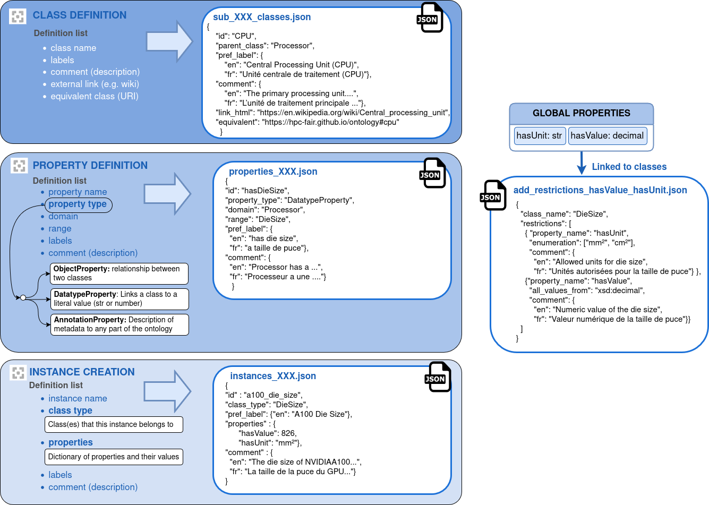

# Exa-AToW Ontology

This ontology models the core entities and relationships involved in the **Exa-AToW**  project (part of the NumPEX PEPR initiative), focusing on high-performance computing (HPC) workflows, resources, and user interactions.

The ontology is serialized in **Turtle (TTL)** format and can be used in **Semantic Web** applications and **Linked Open Data (LOD)** environments.

https://cnherrera.github.io/Exa-AToW_onto/index-en.html


## 🔍 Ontology Concepts

The ontology defines key concepts for the ExA-AToW ecosystem:
(*Bold items indicate concepts that are under review*)
- **Job**: Represents computational tasks, job descriptions, submission metadata, scheduling attributes, and runtime behavior in HPC environments.
- **HPCResource**: Covers physical and virtual resources in HPC, including compute nodes, storage, interconnects, and infrastructure.
- **ProcessorIndicatorEstimator**: Groups estimation tools, metrics, and models used to assess processor indicators such as power consumption, thermal footprint, and die size.
- **PhysicalCharacteristic**: Captures physical and structural properties of HPC components like memory capacity, die size, material lifetime, and energy efficiency.
- **Workflow**: Encompasses workflow-related entities such as execution steps, workflow engines, orchestration strategies, and dependencies. Based on:  
  > Suter, F., et al. (2026). *A terminology for scientific workflow systems*. FGCS 174, 107974. [DOI](https://doi.org/10.1016/j.future.2025.107974)
- User: (TBD) Describes individuals or agents interacting with HPC systems, including identity attributes, roles, and behaviors.
- Authentication: (TBD) Models authentication concepts including credentials, identity validation, access protocols, and login activities.
- Digital Twins: (TBD)


# Ontology Construction: For Exa-AToW partners!

**`Exa-AtoW ontology visual guide`**:

https://cnherrera.github.io/Exa-AToW_onto/help_to_generate_onto_fromIA.html


## Repository Structure

### Main Files (Root Directory)

The repository contains three primary files at the root level:

- **`ontology_generator.py`**: Python script that generates the ontology file from JSON definitions. This script reads all JSON files in the `files/` folder and produces the complete ontology in Turtle format.

- **`ontology_config.yaml`**: Configuration file containing ontology metadata, namespaces, and generation settings. Modify this file to update ontology-level information (e.g., version, authors, namespaces).

- **`exaatow-ontology.ttl`**: Main ontology file in Turtle format. This file is **automatically generated** by `ontology_generator.py` based on the JSON files defined in the `files/` folder. **Do not edit this file manually** - instead, modify the JSON source files.


### files folder
This `files` folder in this repository contains JSON files that define the ontology structure, each file serving a specific purpose:

#### Class Definitions
- `main_classes.json` - Core top-level classes of the ontology

- `sub_HPC_classes.json` - Subclasses related to High-Performance Computing concepts
- `sub_PIE_classes.json` - Subclasses for PIE (Performance, Integration, Execution) components
- `sub_Job_classes.json` - Subclasses defining job-related entities
- `sub_Workflow_classes.json` - Subclasses for workflow structures and components
- `sub_PhysChar_classes.json` - Subclasses for physical characteristics
- ...

> **Note**: Each area of the project should have a JSON file with this structure. Each partner should fill in the required information for their domain.

#### Property Definitions
- `properties_HPC.json` - Object and data properties specific to HPC domain
- `properties_workflow.json` - Properties for workflow description and relationships
- ...
> **Note**: Each area of the project should have a JSON file with this structure. Each partner should fill in the required information for their domain.

#### Instance Data
- `instances_workflow.json` - Individual instances of workflow entities
- ....

#### Restrictions and Constraints
- `add_restrictions_hasValue_hasUnit.json` - Value restrictions and unit assignments for properties

---

# Updating the Ontology



When modifying the ontology, update the appropriate JSON file(s) based on what you're changing:

## Adding New Classes

Each project area should have its own JSON file using the same structure.

### Entry Example
The `parent_class` field can be omitted if the entry directly belongs (subClassOf) to the class designated in the name of the JSON file.
```json
{
    "id": "ComputeNode",
    "parent_class": "HPCResource",
    "pref_label": {"en": "Node", "fr": "Noeud"},
    "comment": {
       "en": "A physical or virtual server that executes computational jobs within a partition.",
       "fr": "Un serveur physique ou virtuel qui exécute des tâches de calcul au sein d'une partition."
    },
    "link_html": "https://wiki.external.link" 
    "equivalent": "https://link.to.ontology#Concept"
}

```

### Steps:
- Edit the relevant `main_classes.json` or `sub_*_classes.json` file
- Add your class definition following the structure above
- Validate the JSON syntax before committing

## Adding Properties

The goal is to define relationships between existing classes using JSON property definitions. For example, connect a `Processor` class to a `DieSize` class using a `hasDieSize` property.

### Property Example
The `parent_class` field can be omitted if the entry directly belongs (subClassOf) to the class designated in the name of the JSON file.
```json
{
    "id": "hasDieSize",
    "property_type": "ObjectProperty",    
    "domain": "Processor",
    "range": "DieSize",
    "pref_label": {
        "en": "has die size",
        "fr": "a taille de puce"
    },
    "comment": {
        "en": "Processor has a die size, including a numeric value and a unit (e.g., mm²).",
        "fr": "Processeur a une taille de puce, incluant une valeur numérique et une unité (ex : mm²)."  
    }
}
```
### Steps:
*Option 1* : Add to existing file
- Add your property to an existing properties_*.json file if it fits that domain

*Option 2* : Create new file
- Create a new file: `properties_<your_field>.json` (in files folder)
- Add your properties as an array
- Register the file in `list_properties` in the ontology_generator.py file (`main`)


## Adding Instances

Only fixed instances will be included in the ontology.
To create instances for your area, create a JSON file with each instance defined as follows (see `files/instances_workflow.json` for reference):

### Instance Example
```json

{
    "instance_name": "InMemory",
    "class_type": "DataManagementStorage",
    "pref_label": {"en": "In-Memory", "fr": "En mémoire"},
    "comment": {
        "en": "Data held in RAM.",
        "fr": "Données conservées en RAM."
    }
}
```
### Steps:
- Modify `instances_workflow.json` or create a new instances file
- Add your instance definitions following the structure above
- Validate the JSON syntax before committing


## Visualization
To visualize the ontology:

- Use WebVOWL (through the ontology webpage generated with Widoco: XXXX)
- Open the `exaatow-ontology.ttl` with the open-source software Protege.
- visualization tool in the Python file. After loading the ontology:
```
onto.visualize_graph(
    output_file="my_ontology_visualization.html",
    height="600px",
    physics=False  # Disable physics for static layout
```
and open the html file with a browser.


