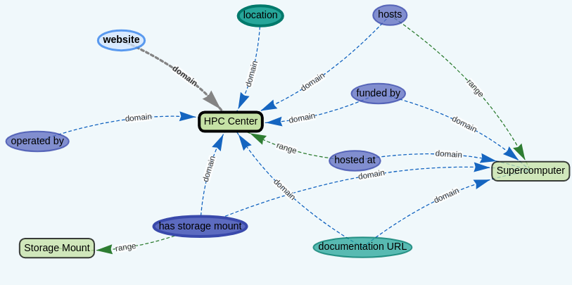
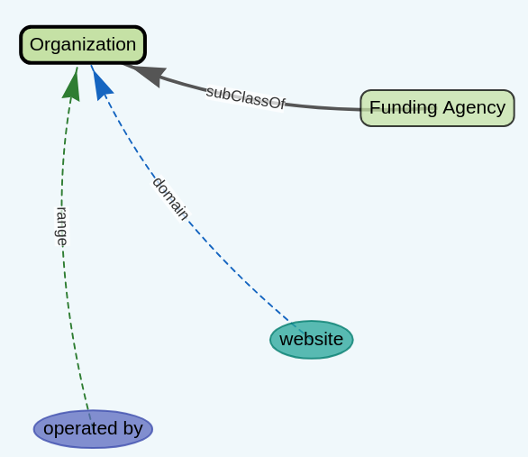
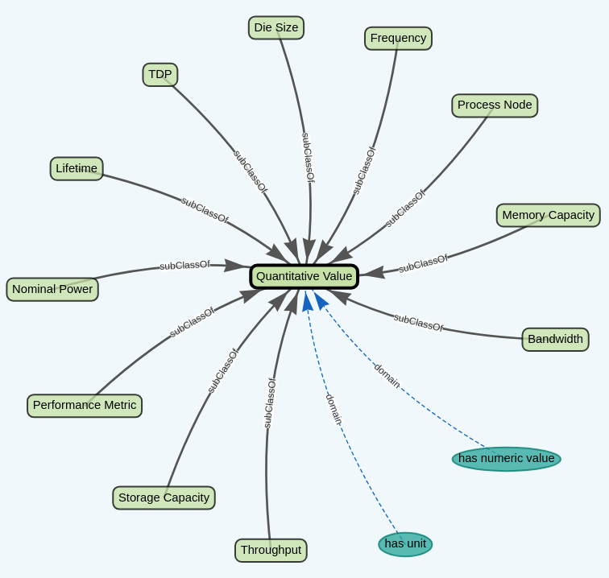
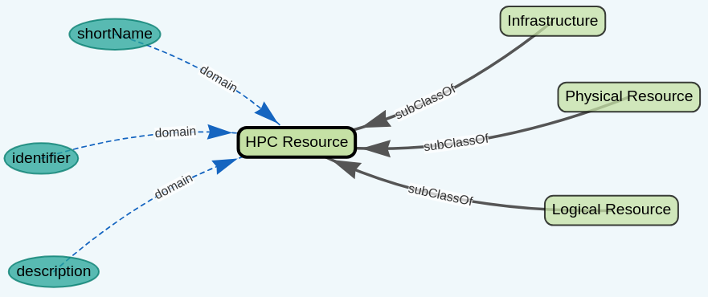
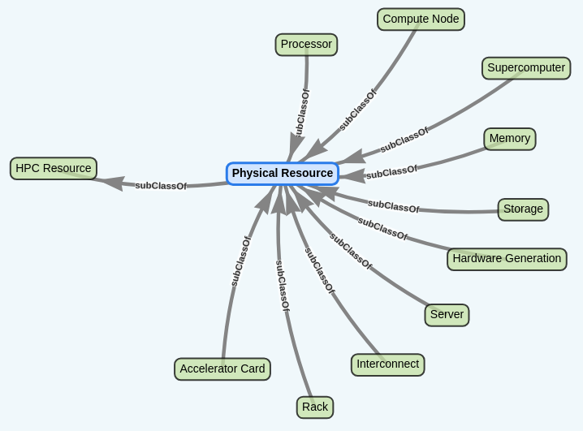
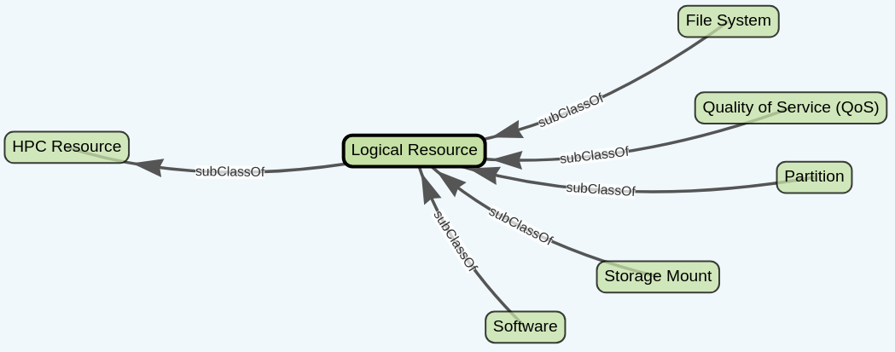
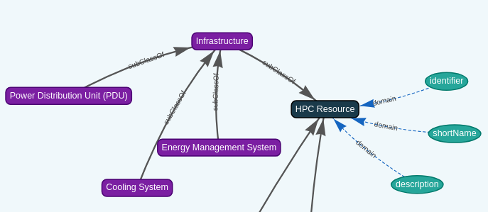
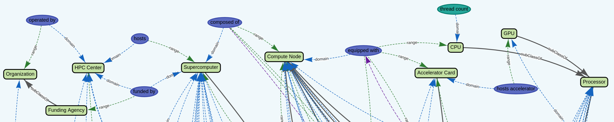

# Exa-AToW HPC Resource Ontology


| Resource | Link |
|---|---|
| Ontology (TTL) | https://cnherrera.github.io/Exa-AToW_onto/hpc_ontology/exaatow_hpc_ontology.ttl |
| Knowledge Graph viewer | https://cnherrera.github.io/Exa-AToW_onto/hpc_ontology/onto-viewer.html |
| Widoco documentation |  https://cnherrera.github.io/Exa-AToW_onto/hpc_ontology/index-widoco.html |

## Overview

The **Exa-AToW HPC Ontology** is an OWL 2 DL knowledge representation designed to formally describe the hardware, software, storage infrastructure, and organizational structure of High-Performance Computing (HPC) centers. It was developed within the Exa-AToW project as the semantic backbone for describing and comparing the French national supercomputing ecosystem.

Once instantiated with real system data, it enables answering structured SPARQL queries such as:
- Which partitions provide access to NVIDIA H100  or AMD MI250X GPUs?
- Which systems use Slurm? Which compilers are available per partition?
- What storage mounts are available to compute jobs?
- How does Adastra's AMD ROCm stack differ from Jean Zay's CUDA-based environment?

By encoding these facts as machine-readable RDF triples, the ontology supports interoperability, automated documentation, and integration with other semantic resources such as the PIE environmental impact ontology.

## Architecture

The ontology is organized around four disjoint top-level branches:

| Branch  | Information  |   |
|---|---|---|
| HPC Center  | *Definition:* Institutional entity that operates and hosts one or more supercomputers. <br> |   |
| Organization  | *Definition:* Institutions operating or funding centers. <br> *Key Classes:* `Funding Agency`    |    |
| Quantitative Value  | *Definition:* Typed numeric values with an associated unit of measurement.  <br> *Key Classes:* `Die Size`, `MemoryCapacity`, `TDP`, `Lifetime`, ... |    |
| HPC Resource  | *Definition:* All resources involved in high-performance computing. <br> *Key Classes:* `Infrastructure`, `LogicalResource`, `PhysicalResource` |    |

### The HPC Resource branch

| Branch | Description | Key classes |
|---|---|---|
| **PhysicalResource** | All tangible hardware | `Supercomputer`, `ComputeNode`, `HardwareModel`, `HardwareComponent` and all their subclasses <br>  |
| **LogicalResource** | Software-defined or scheduler-visible resources | `Partition`, `QoS`, `FileSystem`, `StorageMount`, `Software` and subclasses <br>  |
| **Infrastructure** | Facility-level support systems | `CoolingSystem`, `EnergyManagement`, `PowerDistributionUnit` <br> |


### Core design pattern: HardwareModel vs HardwareComponent

A central design decision separates **abstract hardware specifications** (`HardwareModel`) from **contextualized instantiations** (`HardwareComponent`):

```
ComputeNode
  ├─ hasCPUComponent ──────────► CPUComponent
  │                                  ├─ refersToModel ──► CPU (e.g. AMD EPYC 9654)
  │                                  └─ model: str  
  │                                  └─ quantity: int
  ├─ hasAcceleratorCardComponent ► AcceleratorCardComponent
  │                                  ├─ refersToModel ──► AcceleratorCard (e.g. MI250X)
  │                                  └─ model: str  
  │                                  └─ quantity: int
  ├─ hasMemoryComponent ──────────► MemoryComponent
  │                                  ├─ refersToModel ──► RAM / HBMMemory
  │                                  └─ model: str  
  │                                  └─ quantity: int
  ├─ hasInterconnectComponent ────► InterconnectComponent
  │                                  ├─ refersToModel ──► Interconnect (e.g. Slingshot)
  │                                  └─ model: str  
  │                                  └─ linkCount: int
  └─ hasStorageComponent ─────────► StorageComponent
                                     ├─ refersToModel ──► SSD / HD
                                     └─ model: str  
                                     └─ quantity: int
```


Example:

HPC Center → *hosts* → Supercomputer → *composed of* → [Partition, ComputeNode] → *hasComponent* →  *hasCPUComponent*/* hasAcceleratorCardComponent* → CPU Component / Accelerator Card Component → CPUs / Accelerator Card (→ GPU)



### Energy calculation path

The ontology was designed to feed energy microservices (PUE estimation, carbon footprint):

```
Partition
  └─ usesNodeType ──► ComputeNode
                         ├─ hasNominalPower ──► NominalPower  (e.g. 945 W / scalar node)
                         ├─ hasCPUComponent
                         │    └─ refersToModel ──► CPU ──► hasTDP ──► TDP  (e.g. 360 W)
                         └─ hasAcceleratorCardComponent
                              └─ refersToModel ──► AcceleratorCard ──► hasTDP ──► TDP  (e.g. 560 W)
```

`NominalPower` (on `ComputeNode`) captures the full node power budget including DRAM and board overhead.

`TDP` (on `Processor` and `AcceleratorCard`) captures the manufacturer-specified per-component thermal design power.

---


---
## Validation
SHACL Shapes to be defined.


---

## License

© Exa-AToW team. See project repository for license details.
