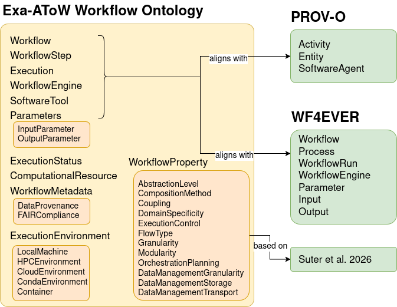
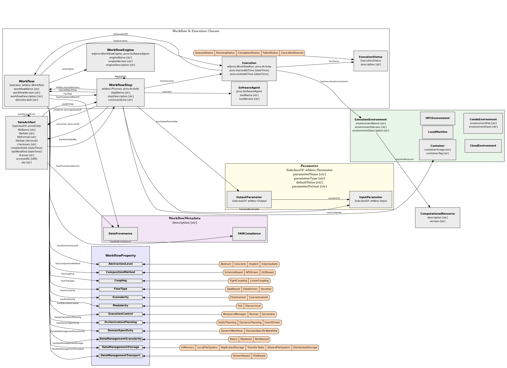

# Exa-AToW Workflow Ontology

## Namespace:
https://raw.githubusercontent.com/logistica-dev/exa-atow-ontologies/refs/heads/main/workflow_ontology/exaatow_workflow_ontology.ttl

## Overview
https://cnherrera.github.io/Exa-AToW_onto/workflow_ontology/index-en.html
<!-- https://logistica-dev.github.io/exa-atow-ontologies/workfloe_ontology/index-en.html -->

The Exa-AToW Workflow Ontology provides a structured vocabulary to describe scientific workflows, their execution environments, provenance, and cross-WMS (Workflow Management System) interoperability. It extends and aligns with W3C standards including PROV-O and WF4EVER (wfdesc and wfprov) to provide domain-specific capabilities for heterogeneous workflow systems. It also includes workflow property framework described by Suter et al. (2026), a conceptual model for characterizing workflow design and execution features such as *granularity, modularity, flow type, and coupling*.

## Key Features

- Workflow Modeling: Represents workflows, workflow steps, and dependencies.
- Execution Tracking: Includes execution environments (LocalMachine, HPCEnvironment, Container, etc.) and execution status.
- Parameterization: Models input/output parameters and their data types or formats.
- Data Management: Captures data artifacts, their formats, and transport/storage mechanisms.
- Cross-WMS Interoperability: Designed to bridge multiple workflow management systems
- Rich Workflow Properties: Captures design patterns, execution characteristics, and data management strategies, based on Suter, F., et al. (2026) https://doi.org/10.1016/j.future.2025.107974
- Provenance Tracking: Full integration with PROV-O for data lineage and execution history
- Modular Architecture: Support for hierarchical workflows and nested sub-processes
- FAIR Principles: Built-in support for FAIR compliance assessment and metadata

## Alignement to existing ontologies

## Description of the ontology

